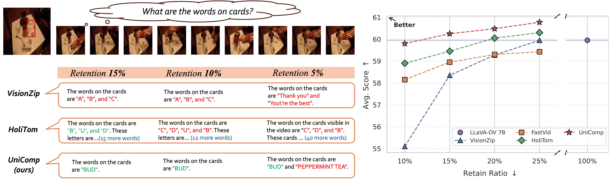
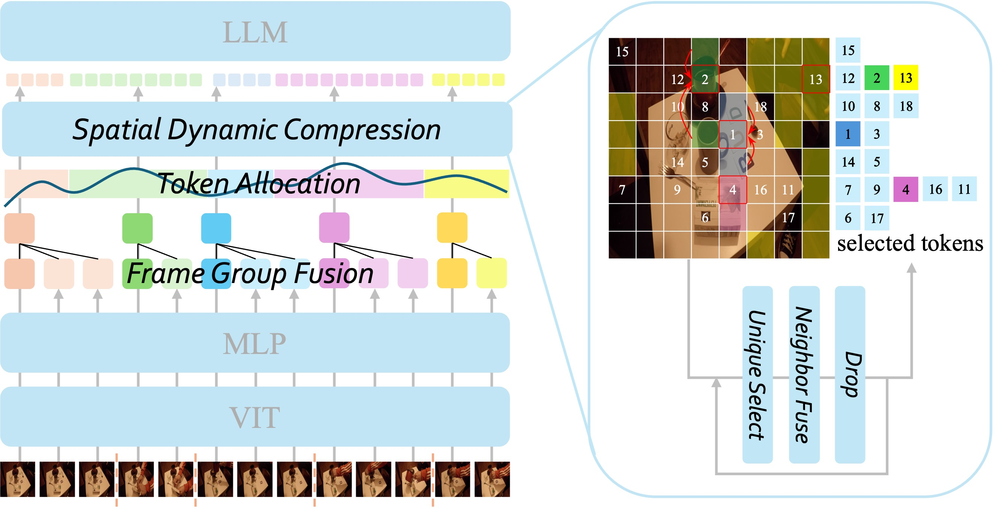
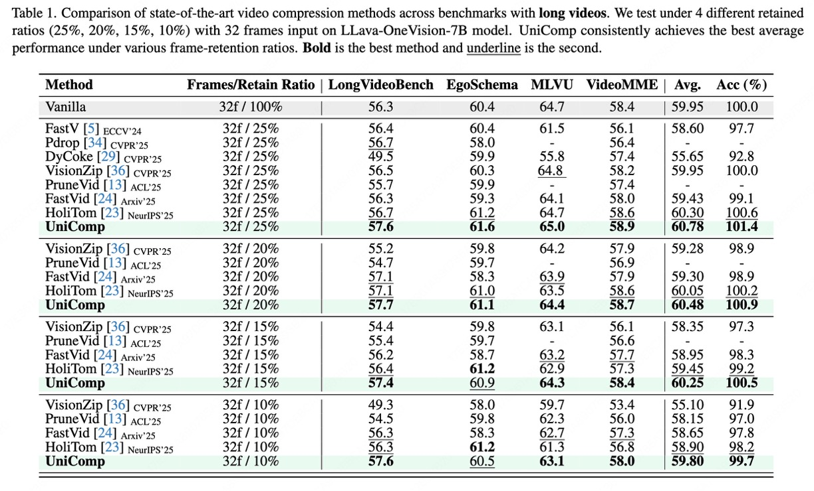
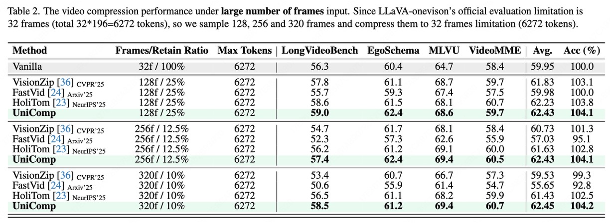

<div align="center">
<h1>UniComp</h1>

<h3>Rethinking Video Compression Through Informational Uniqueness</h3>
</div>


<div align='center'>
    <a href='http://arxiv.org/abs/2512.03575'></a>
</div>

<p align="center"><i>🔥 The State-of-the-Art Method of video compression. 🔥</i></p>

<p align="center">


</p>

## 🔥🔥🔥 News

- **2025-12-4:** Paper is available at [arXiv](http://arxiv.org/abs/2512.03575). Please refer to it for more details.
- **2025-12-3:** We launched UniComp, a training-free video compression method.


## 🚀 Environment
Our code is easy to use.
1. [For demo] Install the [LLaVA-NeXT](https://github.com/LLaVA-VL/LLaVA-NeXT) environment.
2. [For eval] Install the [Lmms-eval](https://github.com/EvolvingLMMs-Lab/lmms-eval) environment.

## ⚒️ Quick Start
Change the retained ratio, video and question setting in [demo.sh](demo.sh).
And run:
```python
bash demo.sh
```
We also offer the demo of baseline, HoliTom and VisionZip, please check [demo.sh](demo.sh) for more detail.

## 📝 Other VLMs Applicaton
UniComp supports extremly convenient application to other VLMs with few lines:
```python
# ... ViT+MLP to get image_feat

# if possible, we recommend to use the KEYs of the last layer attention of ViT
# keys = ...

retain_ratio = float(os.environ.get("RETAIN_RATIO", 0.5))
frame_uniqueness = float(os.environ.get("Uf", 0.005))
spatial_uniqueness = float(os.environ.get("Uc", 0.2))

frames = image_feat.shape[0]
frame_tokens = image_feat.shape[1]

# =========== Frame Group Fusion ============
image_feat, selected_ids = frame_group_fusion(image_feat, metric=None, uniqueness = frame_uniqueness)

if auto_compression:
    tokens_per_frame = torch.tensor([image_feat.shape[1]] * image_feat.shape[0]).to(image_feat.device)
else:
    max_tokens=int(retain_ratio*frames*frame_tokens)   
    # =========== Token Allocation ===========
    tokens_per_frame = token_allocation(image_feat, max_tokens=max_tokens, max_token_per_item=frame_tokens)

# =========== Spatial Dynamic Compression ===========
image_feat = spatial_dynamic_compression(image_feat, tokens_per_frame=tokens_per_frame, uniqueness=spatial_uniqueness)

# use KEYS
# image_feat = spatial_dynamic_compression(image_feat, metric=key[selected_ids], tokens_per_frame=tokens_per_frame, uniqueness=spatial_uniqueness)

# ... LLM
```


## 📊 Evaluation 
We use [lmms-eval](https://github.com/EvolvingLMMs-Lab/lmms-eval) to evaluate. Following HoliTom and VisionZip, we wrap the model with our compression functions.
Here is an example:
```bash
# 32 frames, retain ratio 0.1
WRAPPER=unicomp RETAIN_RATIO=0.1 Uf=0.005 Uc=0.2 \
accelerate launch --num_processes=8 --main_process_port=25000 \
-m lmms_eval \
--model llava_onevision \
--model_args pretrained=lmms-lab/llava-onevision-qwen2-7b-ov,conv_template=qwen_1_5,model_name=llava_qwen,max_frames_num=32 \
--tasks egoschema,mlvu,videomme,longvideobench_val_v \
--batch_size 1 \
--log_samples \
--log_samples_suffix llava_onevision \
--output_path ./logs/ov-7b-unicomp/0.10 2>&1 | tee ./logs/ov-7b-unicomp/0.10/ov-7b-unicomp-0.10.log
```
Or, you can simply use examples we prepared in the [scripts](scripts) folder to evaluate. We have integrated evaluations of various SOTA methods (VisionZip, FastVid, HoliTom).
```bash
bash scripts/eval_ov-7b_unicomp.sh
```

## 👀 Results
 </p>
 </p>

## Acknowledgement
This work is built on [LLaVA-NeXT](https://github.com/LLaVA-VL/LLaVA-NeXT), [lmms-eval](https://github.com/EvolvingLMMs-Lab/lmms-eval), [HoliTom](https://github.com/cokeshao/HoliTom), [FastVid](https://github.com/LunarShen/FastVID) and [VisionZip](https://github.com/dvlab-research/VisionZip). Thanks for their excellent open-source contributions.


## Citation
If you find our work useful for your research, please consider giving a star and citing the paper:
```bibtex
@article{yuan2025unicomp,
  title={UniComp: Rethinking Video Compression Through Informational Uniqueness},
  author={Yuan, Chao and Chen, Shimin and Lin, Minliang and Qiao, Limeng and Wan, Guanglu and Ma, Lin},
  journal={arXiv preprint arXiv:2512.03575},
  year={2025}
}
```
